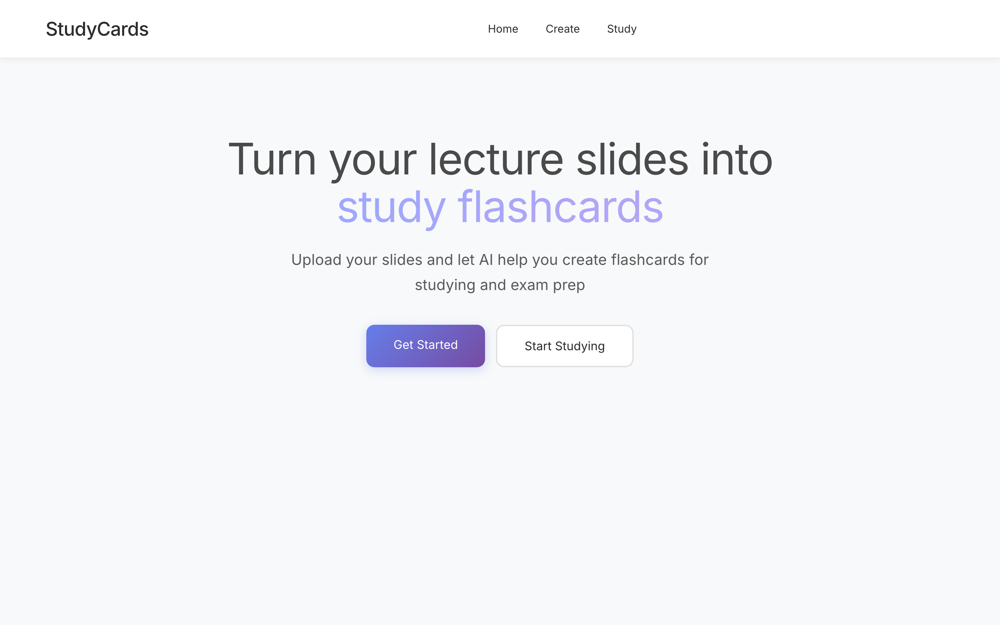
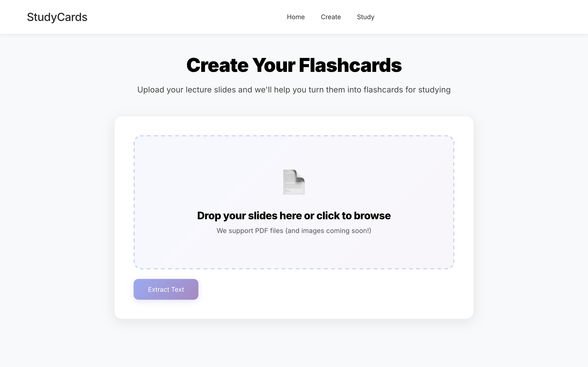
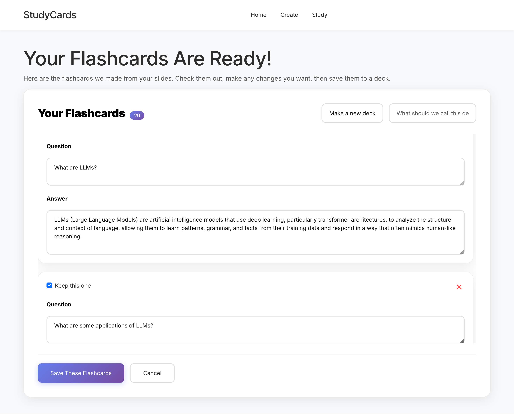
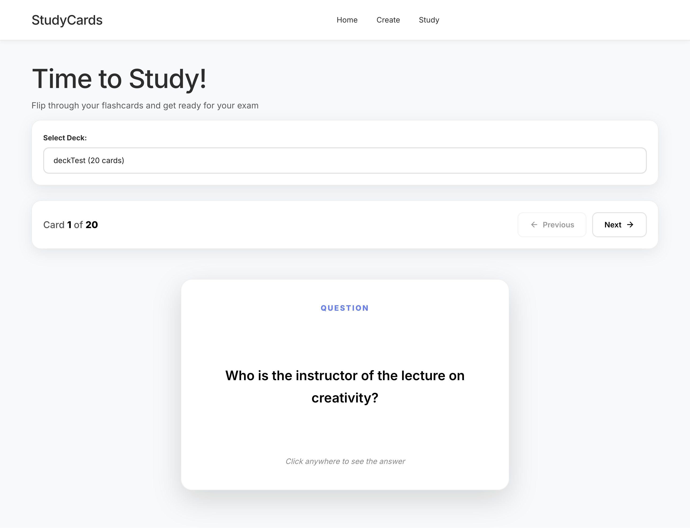
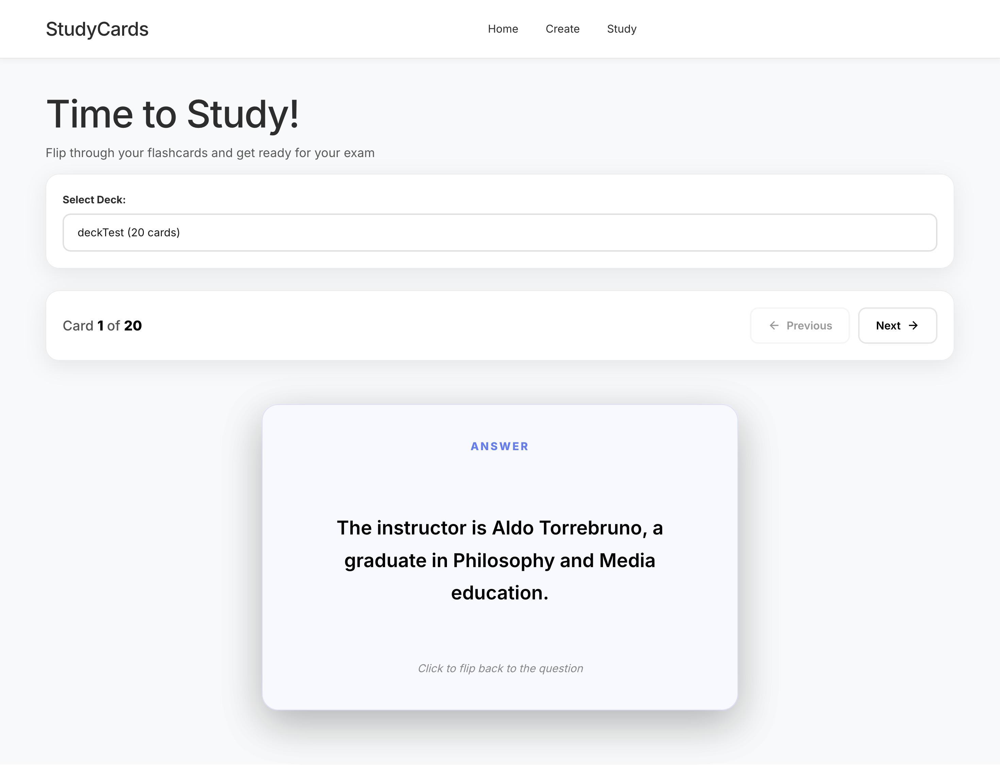

# Flashcard App

An AI-powered flashcard application that helps you create study flashcards from lecture slides.

## Screenshots
<div align="center">
  
  <br>
  <em>Figure 1 - Home Page</em>
</div> 
<br>

<div align="center">
  
  <br>
  <em>Figure 2 - Create Page</em>
</div>
<br>

<div align="center">
  
  <br>
  <em>Figure 3 - The page after the AI finishes generating the flashcards.</em>
</div>
<br>

<div align="center">
  
  <br>
  <em>Figure 4 - Study Page with an Example Question</em>
</div>
<br>

<div align="center">
  
  <br>
  <em>Figure 5 - Study Page with an Example Answer</em>
</div>

## Features

- 📤 **Upload Slides**: Upload PDF files of your lecture slides
- 🤖 **AI Generation**: Automatically extract text and generate flashcards using AI
- ✏️ **Review & Edit**: Review and edit AI-generated flashcards before saving
- 📚 **Study Mode**: Study flashcards with beautiful flip animations
- 🗂️ **Deck Organization**: Organize flashcards into decks

## Setup

### 1. Install Dependencies

The project uses .NET 9.0. Make sure you have it installed, then restore packages:

```bash
dotnet restore
```

### 2. Configure AI API Key

The app uses **Groq AI** to generate flashcards. We use User Secrets to store the API key locally.

**Set your API key:**
```bash
cd FlashcardApp
dotnet user-secrets set "Groq:ApiKey" "your-groq-api-key-here"
```

**Get your API key:**
1. Sign up at [Groq Console](https://console.groq.com/)
2. Create an API key

### 3. Run the Application

```bash
cd FlashcardApp
dotnet run
```

The app will be available at `https://localhost:7199` or `http://localhost:5037`.

## Usage

1. **Upload Slides**: Go to "Upload Slides" and select a PDF file
2. **Extract Text**: Click "Extract Text" to extract text from the PDF
3. **Generate Flashcards**: Click "Generate Flashcards with AI" to create flashcards
4. **Review & Edit**: Review the generated flashcards, edit if needed, select which to keep
5. **Save**: Choose or create a deck, then save the flashcards
6. **Study**: Go to "Study" to view and flip through your flashcards

## Database

The app uses SQLite (stored as `flashcards.db` in the project root). The database is automatically created on first run.

## Notes

- User Secrets are stored locally on your machine and never committed to Git
- Each team member sets their own API key
- The app automatically loads User Secrets in Development mode

